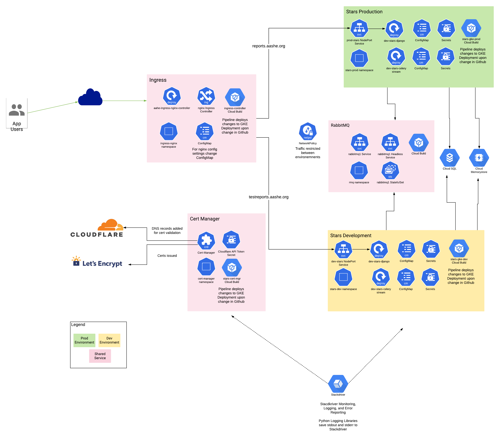

# Stars Kubernetes

The following products are used in GCP for Stars.  More details are in the below sections.
* GKE to host the Stars Prod, Dev environments
* GKE to host RabbitMQ, Certificate Manager, NGINX Ingress Controller
* MySQL in Cloud SQL to host the Stars database
* Memcache to host the Stars cache
* Cloud Storage to host the media and static files (future)
* IAM Service Account to acess Cloud Storage (future)
* Container Registry to host the contain images
* Cloud Build to build the containers and deploy changes to GKE



## GKE Cluster

A zonal GKE cluster is deployed.  Use of a regional GKE cluster was considered during the design, but there was not enough of a justification in availability for the increase in cost.

The stable release channel is used because no beta features are needed for Kuberentes.

The shell script to reinstall the GKE cluster is [here](../utils/create-cluster.sh)

### Namespaces
Namespaces are configured on the GKE cluster to seperate applications development environments.  AASHE has a prod and dev environment for each application.

| Namespace                       | Summary                                                 |
|---------------------------------|---------------------------------------------------------|
|cert-mgr                         | Namespace for cert managerd used by all environemnts    |
|rmq                              | Namespace for RabbitMQ instance used by all environments|
|ingress-nginx                    | Location of ingress controller used by all environments |
|config-connector-operator-system | Used to create and configure non GCP services           |
|stars-prod                       | Stars production environment                            | 
|stars-dev                        | Stars development environment                           |

## Cloud Build
GKE is integrated with the AASHE Stars Github site using the Cloud Build GitHup to deploy new code into GKE.  CloudBuild has the below triggers.

| Name                    | Description                                                            |
|-------------------------|------------------------------------------------------------------------|
|ingress-controller       | Creates Ingress Controller and used to update configuration            |
|kustomize-client         | Builds kustomize docker image.  Used stars-gke-dev and stars-gke-prod  |
|stars-cert-mgr-prod      | Creates Cert Manager and used to update configuration                  |
|stars-gke-dev            | Deploys changes in code to stars development in GKE                    |
|stars-gke-prod           | Deployes changes to gke stars production in GKE                        |

[Kustomize](https://kubernetes.io/docs/tasks/manage-kubernetes-objects/kustomization/) is used as the templating engine to make changes to the environment.  Using the principles of configuration as data and GitOps there is a single set of kubernetes deployment yaml per application.  This prevents duplication of kubernetes yaml files that have the same settings largely repeated between environments.  Below is a summary of the directory structure in this directory.

* Base
** celery: base Celery deployment YAML file
** django: base Django deployment and service file

* Overlays
** cert-manager: Stars certifite files
** dev: Stars development variables
** prod: Stars Production variables

A kustomization.yaml is located overlay which specific the base directory, config map values, and a path to secrets.  The kustomize config map and secrets generator is used to generate config maps and secrets.  Due to the sensitive nature of data in secrets the files used secret generator are stored in GCP Secret Manager and loaded by the Cloud Build pipeline during deployment and not stored in Github.

### Stars Dev


### Stars Prod


## Container Registry

The GCP Container Registry is enabled in the aashe-gcp-migration GCP project.  The container registry is set to private and Vulnerability Scanning is enabled.

Below are the images used.  A seperate base image was created for Stars do to the build time.  The stars image is used as a base layer for the stars image.

| Image Name     | Cloud Build Trigger | Description                                                 |
|----------------|------------------|----------------------------------------------------------------|
|helm            | helm-client      | Creates helm image used by ingress, rmq, cert-mgr pipelines    |
|kustomize       | kustomize-client | Creates kustomize image.  Used stars dev and rpod pipelines    |
|stars-base-image| stars-gke-dev, stars-gke-prod | Base image for stars                              |
|stars-image     | stars-gke-dev, stars-gke-prod | Base image for stars django and celery            |

## Ingress Controller

[Installation Link](https://docs.nginx.com/nginx-ingress-controller/configuration/global-configuration/configmap-resource/#using-configmap)

[Default Values](https://nginx.org/en/docs/http/ngx_http_proxy_module.html?&_ga=2.262455436.1488070266.1606851969-754510161.1606169995#proxy_buffers)

## Cert Manager

[Cert Manager Site](https://cert-manager.io/docs/)
[Cert Manager GitHub Link](https://github.com/jetstack/cert-manager)
[Installation Link](https://cert-manager.io/docs/installation/kubernetes/)

## Manually Run Builds

To install kustomize
```
curl -s "https://raw.githubusercontent.com/\
kubernetes-sigs/kustomize/master/hack/install_kustomize.sh"  | bash
```
Set path for where it is installed or copy to usr/bin

`kustomize build overlays/dev'